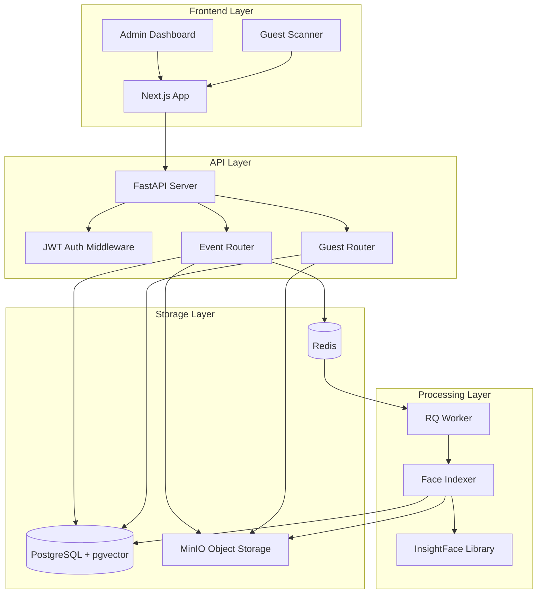
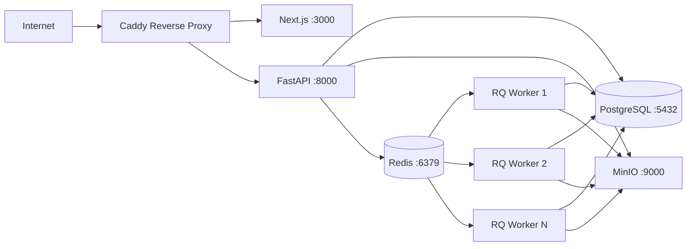

# Design Document: PicUr

## Overview

PicUr is a multi-tenant wedding photo sharing platform built on open-source technologies. The system enables photographers (Admins) to create isolated Events where guests can discover their photos through live face recognition. The architecture emphasizes tenant isolation, event-level data segregation, and scalable face matching using vector similarity search.

The system consists of three main layers:
1. **Frontend**: Next.js application providing Admin dashboard and Guest scanning interface
2. **Backend API**: FastAPI service handling authentication, event management, and face matching
3. **Background Processing**: RQ workers for asynchronous face indexing

Key design principles:
- **Multi-tenancy**: Complete isolation between Admin accounts
- **Event isolation**: Each Event maintains its own photo set and face database
- **Security-first**: JWT tokens, bcrypt hashing, presigned URLs, rate limiting
- **Scalability**: Vector similarity search, background processing, horizontal worker scaling
- **Open-source**: No proprietary dependencies or vendor lock-in

## Architecture

### System Components



### Data Flow

**Admin Photo Upload Flow:**
1. Admin authenticates with JWT token
2. Admin uploads photos to specific Event via API
3. API validates ownership (owner_user_id matches JWT)
4. Photos stored in MinIO at `events/{eventId}/original/{imageId}.jpg`
5. Thumbnails generated and stored at `events/{eventId}/thumb/{imageId}.jpg`
6. Image records created with status='pending'
7. Jobs queued in Redis for face indexing
8. RQ worker processes each image:
   - Downloads from MinIO
   - Detects faces using InsightFace
   - Computes 512-dim embeddings
   - Stores embeddings in pgvector
   - Updates image status to 'indexed'

**Guest Face Scan Flow:**
1. Guest visits `/e/{slug}` with optional passcode
2. System creates Event_Token scoped to event_id
3. Guest captures face via WebRTC camera
4. Frontend sends face image to API with Event_Token
5. API detects face and computes embedding
6. API performs vector similarity search filtered by event_id
7. API returns matched images with presigned URLs
8. Guest views/downloads photos (if allowed)

### Deployment Architecture



All services run in Docker containers orchestrated by Docker Compose.

## Components and Interfaces

### 1. Authentication Service

**Responsibilities:**
- Admin registration and login
- JWT token generation and validation
- Password hashing with bcrypt
- Event_Token generation for Guests

**Interfaces:**

```python
# Admin Authentication
POST /auth/register
Request: {
    "email": "photographer@example.com",
    "password": "securepassword"
}
Response: {
    "user_id": "uuid",
    "email": "photographer@example.com",
    "created_at": "2024-01-01T00:00:00Z"
}

POST /auth/login
Request: {
    "email": "photographer@example.com",
    "password": "securepassword"
}
Response: {
    "access_token": "jwt_token_string",
    "token_type": "bearer",
    "expires_in": 86400
}

GET /auth/me
Headers: Authorization: Bearer {jwt_token}
Response: {
    "user_id": "uuid",
    "email": "photographer@example.com"
}
```

**JWT Token Structure:**
```json
{
    "sub": "user_id",
    "email": "photographer@example.com",
    "exp": 1704153600,
    "iat": 1704067200
}
```

**Event_Token Structure:**
```json
{
    "event_id": "uuid",
    "session_id": "uuid",
    "exp": 1704153600,
    "iat": 1704067200
}
```

### 2. Event Management Service

**Responsibilities:**
- Create and manage Events
- Generate unique slugs and QR codes
- Track upload and indexing status
- Enforce owner_user_id filtering

**Interfaces:**

```python
POST /events
Headers: Authorization: Bearer {jwt_token}
Request: {
    "name": "Smith Wedding",
    "date": "2024-06-15",
    "passcode": "optional_passcode",
    "allow_downloads": true,
    "retention_days": 90
}
Response: {
    "event_id": "uuid",
    "slug": "smith-wedding-abc123",
    "name": "Smith Wedding",
    "date": "2024-06-15",
    "guest_link": "https://domain/e/smith-wedding-abc123",
    "qr_code_url": "https://domain/api/events/{event_id}/qr",
    "owner_user_id": "uuid",
    "allow_downloads": true,
    "retention_days": 90,
    "created_at": "2024-01-01T00:00:00Z"
}

GET /events
Headers: Authorization: Bearer {jwt_token}
Response: {
    "events": [
        {
            "event_id": "uuid",
            "slug": "smith-wedding-abc123",
            "name": "Smith Wedding",
            "date": "2024-06-15",
            "photo_count": 150,
            "indexed_count": 145,
            "face_count": 423,
            "created_at": "2024-01-01T00:00:00Z"
        }
    ]
}

GET /events/{event_id}
Headers: Authorization: Bearer {jwt_token}
Response: {
    "event_id": "uuid",
    "slug": "smith-wedding-abc123",
    "name": "Smith Wedding",
    "date": "2024-06-15",
    "guest_link": "https://domain/e/smith-wedding-abc123",
    "allow_downloads": true,
    "retention_days": 90,
    "status": {
        "total_photos": 150,
        "pending": 5,
        "indexed": 140,
        "no_faces": 3,
        "failed": 2,
        "total_faces": 423,
        "indexing_percentage": 93.3
    },
    "created_at": "2024-01-01T00:00:00Z"
}

GET /events/{event_id}/qr
Headers: Authorization: Bearer {jwt_token}
Response: PNG image (QR code)


POST /events/{event_id}/reindex
Headers: Authorization: Bearer {jwt_token}
Response: {
    "message": "Reindexing started",
    "queued_count": 150
}
```

### 3. Photo Upload Service

**Responsibilities:**
- Handle bulk photo uploads
- Generate thumbnails
- Extract EXIF metadata
- Compute photo hashes for deduplication
- Queue face indexing jobs

**Interfaces:**

```python
POST /events/{event_id}/photos
Headers: Authorization: Bearer {jwt_token}
Content-Type: multipart/form-data
Request: FormData with multiple image files

Response: {
    "uploaded": [
        {
            "image_id": "uuid",
            "filename": "IMG_1234.jpg",
            "size_bytes": 2048576,
            "status": "pending"
        }
    ],
    "duplicates": [
        {
            "filename": "IMG_5678.jpg",
            "reason": "Hash match with existing image"
        }
    ]
}

GET /events/{event_id}/photos
Headers: Authorization: Bearer {jwt_token}
Query: ?page=1&limit=50&status=indexed
Response: {
    "photos": [
        {
            "image_id": "uuid",
            "filename": "IMG_1234.jpg",
            "status": "indexed",
            "face_count": 3,
            "thumbnail_url": "presigned_url",
            "uploaded_at": "2024-01-01T00:00:00Z"
        }
    ],
    "total": 150,
    "page": 1,
    "limit": 50
}

DELETE /events/{event_id}/photos/{image_id}
Headers: Authorization: Bearer {jwt_token}
Response: {
    "message": "Photo deleted",
    "image_id": "uuid"
}
```

**Storage Paths:**
- Original: `events/{event_id}/original/{image_id}.jpg`
- Thumbnail: `events/{event_id}/thumb/{image_id}.jpg`

### 4. Face Indexing Service

**Responsibilities:**
- Process photos asynchronously via RQ workers
- Detect faces using InsightFace (ArcFace model)
- Compute 512-dimensional embeddings
- Store embeddings in pgvector
- Update image status

**Processing Pipeline:**

```python
# RQ Job Handler
def index_photo(image_id: str):
    # 1. Fetch image record
    image = db.query(Image).filter(Image.id == image_id).first()
    
    # 2. Download from MinIO
    photo_bytes = minio_client.get_object(
        bucket="photos",
        object_name=f"events/{image.event_id}/original/{image.id}.jpg"
    )
    
    # 3. Detect faces using InsightFace
    img = cv2.imdecode(np.frombuffer(photo_bytes, np.uint8), cv2.IMREAD_COLOR)
    faces = face_detector.get(img)
    
    # 4. For each detected face
    for face in faces:
        embedding = face.embedding  # 512-dim vector
        bbox = face.bbox  # [x1, y1, x2, y2]
        quality = face.det_score  # Detection confidence
        
        # 5. Store in database
        db.add(Face(
            image_id=image.id,
            event_id=image.event_id,
            embedding=embedding.tolist(),
            bbox=bbox.tolist(),
            quality_score=quality
        ))
    
    # 6. Update image status
    if len(faces) > 0:
        image.status = "indexed"
        image.face_count = len(faces)
    else:
        image.status = "no_faces"
        image.face_count = 0
    
    db.commit()
```

**InsightFace Configuration:**
- Model: `buffalo_l` (ArcFace)
- Embedding dimension: 512
- Detection threshold: 0.5
- Face size minimum: 64x64 pixels

### 5. Guest Access Service

**Responsibilities:**
- Validate Event slugs and passcodes
- Generate Event_Tokens
- Enforce rate limiting
- Manage Guest sessions

**Interfaces:**

```python
GET /e/{slug}
Response: {
    "event_id": "uuid",
    "name": "Smith Wedding",
    "date": "2024-06-15",
    "requires_passcode": true
}

POST /e/{slug}/auth
Request: {
    "passcode": "optional_passcode"
}
Response: {
    "event_token": "jwt_token_string",
    "event_id": "uuid",
    "event_name": "Smith Wedding",
    "allow_downloads": true,
    "expires_in": 3600
}
```

### 6. Face Matching Service

**Responsibilities:**
- Capture Guest face from camera
- Compute Guest face embedding
- Perform vector similarity search
- Filter results by event_id
- Generate presigned URLs

**Interfaces:**

```python
POST /scan
Headers: Authorization: Bearer {event_token}
Request: {
    "image": "base64_encoded_image"
}
Response: {
    "matches": [
        {
            "image_id": "uuid",
            "similarity": 0.87,
            "thumbnail_url": "presigned_url",
            "original_url": "presigned_url",
            "download_url": "presigned_url",  # Only if allow_downloads=true
            "face_bbox": [100, 150, 200, 250]
        }
    ],
    "scan_id": "uuid",
    "total_matches": 15
}
```

**Vector Similarity Search:**

```sql
-- PostgreSQL with pgvector
SELECT 
    f.image_id,
    f.bbox,
    1 - (f.embedding <=> :query_embedding) as similarity
FROM faces f
JOIN images i ON f.image_id = i.id
WHERE i.event_id = :event_id
    AND i.status = 'indexed'
    AND 1 - (f.embedding <=> :query_embedding) > :threshold
ORDER BY similarity DESC
LIMIT 50;
```

**Similarity Threshold:** 0.6 (configurable)

### 7. Audit Logging Service

**Responsibilities:**
- Log all Admin and Guest actions
- Track face scan attempts and results
- Enable Admin to query logs for their Events

**Interfaces:**

```python
GET /events/{event_id}/logs
Headers: Authorization: Bearer {jwt_token}
Query: ?page=1&limit=50&action=scan
Response: {
    "logs": [
        {
            "log_id": "uuid",
            "event_id": "uuid",
            "actor_type": "guest",
            "action": "scan",
            "metadata": {
                "match_count": 15,
                "similarity_avg": 0.82
            },
            "timestamp": "2024-01-01T12:00:00Z"
        }
    ],
    "total": 234,
    "page": 1,
    "limit": 50
}
```

## Data Models

### Database Schema

```sql
-- Admins (Photographers)
CREATE TABLE users (
    id UUID PRIMARY KEY DEFAULT gen_random_uuid(),
    email VARCHAR(255) UNIQUE NOT NULL,
    password_hash VARCHAR(255) NOT NULL,
    created_at TIMESTAMP DEFAULT NOW(),
    updated_at TIMESTAMP DEFAULT NOW()
);

-- Events (Weddings/Sessions)
CREATE TABLE events (
    id UUID PRIMARY KEY DEFAULT gen_random_uuid(),
    owner_user_id UUID NOT NULL REFERENCES users(id) ON DELETE CASCADE,
    slug VARCHAR(255) UNIQUE NOT NULL,
    name VARCHAR(255) NOT NULL,
    date DATE,
    passcode_hash VARCHAR(255),  -- NULL if no passcode
    allow_downloads BOOLEAN DEFAULT true,
    retention_days INTEGER DEFAULT 90,
    created_at TIMESTAMP DEFAULT NOW(),
    updated_at TIMESTAMP DEFAULT NOW(),
    INDEX idx_owner (owner_user_id),
    INDEX idx_slug (slug)
);

-- Photos
CREATE TABLE images (
    id UUID PRIMARY KEY DEFAULT gen_random_uuid(),
    event_id UUID NOT NULL REFERENCES events(id) ON DELETE CASCADE,
    filename VARCHAR(255) NOT NULL,
    file_hash VARCHAR(64) NOT NULL,  -- SHA256 for deduplication
    size_bytes BIGINT NOT NULL,
    width INTEGER,
    height INTEGER,
    exif_data JSONB,
    status VARCHAR(20) NOT NULL,  -- pending, indexed, no_faces, failed
    face_count INTEGER DEFAULT 0,
    uploaded_at TIMESTAMP DEFAULT NOW(),
    indexed_at TIMESTAMP,
    INDEX idx_event (event_id),
    INDEX idx_status (status),
    INDEX idx_hash (event_id, file_hash),
    CONSTRAINT unique_hash_per_event UNIQUE (event_id, file_hash)
);

-- Face Embeddings
CREATE TABLE faces (
    id UUID PRIMARY KEY DEFAULT gen_random_uuid(),
    image_id UUID NOT NULL REFERENCES images(id) ON DELETE CASCADE,
    event_id UUID NOT NULL REFERENCES events(id) ON DELETE CASCADE,
    embedding vector(512) NOT NULL,  -- pgvector type
    bbox FLOAT[4] NOT NULL,  -- [x1, y1, x2, y2]
    quality_score FLOAT NOT NULL,
    created_at TIMESTAMP DEFAULT NOW(),
    INDEX idx_image (image_id),
    INDEX idx_event (event_id)
);

-- Vector similarity index
CREATE INDEX idx_faces_embedding ON faces 
USING ivfflat (embedding vector_cosine_ops)
WITH (lists = 100);

-- Guest Sessions
CREATE TABLE guest_sessions (
    id UUID PRIMARY KEY DEFAULT gen_random_uuid(),
    event_id UUID NOT NULL REFERENCES events(id) ON DELETE CASCADE,
    session_token VARCHAR(255) UNIQUE NOT NULL,
    expires_at TIMESTAMP NOT NULL,
    created_at TIMESTAMP DEFAULT NOW(),
    INDEX idx_event (event_id),
    INDEX idx_token (session_token)
);

-- Audit Logs
CREATE TABLE audit_logs (
    id UUID PRIMARY KEY DEFAULT gen_random_uuid(),
    event_id UUID NOT NULL REFERENCES events(id) ON DELETE CASCADE,
    actor_type VARCHAR(20) NOT NULL,  -- admin, guest
    actor_id UUID,  -- user_id or session_id
    action VARCHAR(50) NOT NULL,  -- access, scan, upload, reindex, delete
    metadata JSONB,
    timestamp TIMESTAMP DEFAULT NOW(),
    INDEX idx_event (event_id),
    INDEX idx_timestamp (timestamp)
);

-- Rate Limiting
CREATE TABLE rate_limits (
    id UUID PRIMARY KEY DEFAULT gen_random_uuid(),
    session_id UUID NOT NULL,
    action VARCHAR(50) NOT NULL,  -- scan
    count INTEGER DEFAULT 1,
    window_start TIMESTAMP NOT NULL,
    INDEX idx_session_action (session_id, action, window_start)
);
```

### Object Storage Structure (MinIO)

```
photos/
├── events/
│   ├── {event_id_1}/
│   │   ├── original/
│   │   │   ├── {image_id_1}.jpg
│   │   │   ├── {image_id_2}.jpg
│   │   │   └── ...
│   │   └── thumb/
│   │       ├── {image_id_1}.jpg
│   │       ├── {image_id_2}.jpg
│   │       └── ...
│   ├── {event_id_2}/
│   │   ├── original/
│   │   └── thumb/
│   └── ...
```

## Correctness Properties

*A property is a characteristic or behavior that should hold true across all valid executions of a system—essentially, a formal statement about what the system should do. Properties serve as the bridge between human-readable specifications and machine-verifiable correctness guarantees.*

### Property 1: Admin Isolation

*For any* two Admin accounts with different user_ids, when Admin A queries their Events, the results SHALL NOT include any Events owned by Admin B.

**Validates: Requirements 1.4, 1.5, 7.5**

### Property 2: Event Token Scoping

*For any* Event_Token generated for Event A, when used to access resources, the token SHALL NOT grant access to photos or faces from Event B.

**Validates: Requirements 5.5, 7.1, 7.4**

### Property 3: Face Search Isolation

*For any* Guest face scan with an Event_Token for Event A, the vector similarity search SHALL only return faces where the associated image's event_id equals Event A's event_id.

**Validates: Requirements 6.3, 7.1, 7.2**

### Property 4: Photo Hash Deduplication

*For any* photo uploaded to an Event, if another photo with the same file hash already exists in that Event, the system SHALL reject the duplicate and return it in the duplicates list.

**Validates: Requirements 3.4**

### Property 5: Presigned URL Validation

*For any* presigned URL generated for an image, when a Guest attempts to access it, the system SHALL verify that the image belongs to the Guest's current Event before serving the content.

**Validates: Requirements 7.3**

### Property 6: JWT Token Expiration

*For any* JWT token (Admin or Event_Token), when the current time exceeds the token's expiration time, the system SHALL reject the token and return an authentication error.

**Validates: Requirements 1.3, 5.6**

### Property 7: Passcode Verification

*For any* Event with a passcode, when a Guest attempts to authenticate, the system SHALL only grant access if the provided passcode matches the stored bcrypt hash.

**Validates: Requirements 5.2, 5.3**

### Property 8: Rate Limit Enforcement

*For any* Guest session, when the number of face scans within a 1-hour window exceeds 10, the system SHALL reject subsequent scan requests with a 429 error until the window resets.

**Validates: Requirements 10.1, 10.2**

### Property 9: Download Permission Enforcement

*For any* Event with allow_downloads set to false, when a Guest requests a download URL, the system SHALL reject the request and return an error.

**Validates: Requirements 8.4**

### Property 10: Face Embedding Consistency

*For any* valid face image, computing the embedding twice using the same InsightFace model SHALL produce embeddings with cosine similarity greater than 0.99.

**Validates: Requirements 4.2, 4.3**

### Property 11: Event Deletion Cascade

*For any* Event that is deleted, all associated images, faces, and audit logs SHALL be removed from the database, and all files SHALL be removed from MinIO storage.

**Validates: Requirements 11.3, 11.4, 11.5**

### Property 12: Ownership Validation on Upload

*For any* photo upload request to an Event, the system SHALL only accept the upload if the JWT token's user_id matches the Event's owner_user_id.

**Validates: Requirements 3.6**

### Property 13: Status Transition Validity

*For any* image, the status SHALL only transition in valid sequences: pending → indexed, pending → no_faces, or pending → failed. No other transitions are allowed.

**Validates: Requirements 4.5, 4.6**

### Property 14: Audit Log Immutability

*For any* audit log entry created, the system SHALL NOT allow modification or deletion of the entry, ensuring a complete audit trail.

**Validates: Requirements 12.1, 12.2, 12.3, 12.4**

### Property 15: Vector Search Threshold

*For any* face scan, all returned matches SHALL have a similarity score greater than or equal to the configured threshold (default 0.6).

**Validates: Requirements 6.4**

## Error Handling

### Error Response Format

All API errors follow a consistent structure:

```json
{
    "error": {
        "code": "ERROR_CODE",
        "message": "Human-readable error message",
        "details": {
            "field": "Additional context"
        }
    }
}
```

### Error Categories

**Authentication Errors (401):**
- `INVALID_TOKEN`: JWT token is malformed or invalid
- `TOKEN_EXPIRED`: JWT token has exceeded expiration time
- `INVALID_CREDENTIALS`: Email/password combination is incorrect
- `INVALID_PASSCODE`: Event passcode is incorrect

**Authorization Errors (403):**
- `FORBIDDEN`: User does not have permission to access resource
- `EVENT_NOT_OWNED`: Admin attempting to access another Admin's Event
- `DOWNLOADS_DISABLED`: Guest attempting to download when not allowed

**Validation Errors (400):**
- `INVALID_IMAGE_FORMAT`: Uploaded file is not a valid image
- `MISSING_REQUIRED_FIELD`: Required field is missing from request
- `INVALID_SLUG`: Event slug format is invalid
- `DUPLICATE_EMAIL`: Email already registered

**Rate Limiting Errors (429):**
- `RATE_LIMIT_EXCEEDED`: Too many requests in time window
- Response includes `Retry-After` header

**Not Found Errors (404):**
- `EVENT_NOT_FOUND`: Event slug does not exist
- `IMAGE_NOT_FOUND`: Image ID does not exist
- `USER_NOT_FOUND`: User ID does not exist

**Server Errors (500):**
- `FACE_DETECTION_FAILED`: InsightFace processing error
- `STORAGE_ERROR`: MinIO operation failed
- `DATABASE_ERROR`: PostgreSQL operation failed

### Error Handling Strategies

**Face Detection Failures:**
- Log error with image_id and stack trace
- Update image status to 'failed'
- Retry up to 3 times with exponential backoff
- After 3 failures, mark as permanently failed

**Storage Failures:**
- Retry MinIO operations up to 3 times
- If upload fails, rollback database transaction
- If download fails during indexing, mark image as failed

**Database Failures:**
- Use database transactions for multi-step operations
- Rollback on any error
- Log all database errors for debugging

**Rate Limiting:**
- Use Redis for distributed rate limit counters
- Sliding window algorithm for accurate counting
- Return clear error messages with retry timing

## Testing Strategy

### Dual Testing Approach

The testing strategy combines unit tests and property-based tests to ensure comprehensive coverage:

- **Unit tests**: Verify specific examples, edge cases, and error conditions
- **Property tests**: Verify universal properties across all inputs using randomized testing

Both approaches are complementary and necessary. Unit tests catch concrete bugs in specific scenarios, while property tests verify general correctness across a wide range of inputs.

### Property-Based Testing Configuration

**Library:** Hypothesis (Python)

**Configuration:**
- Minimum 100 iterations per property test
- Each test tagged with: `# Feature: picur, Property {N}: {property_text}`
- Each correctness property implemented by a SINGLE property-based test

**Example Property Test:**

```python
from hypothesis import given, strategies as st
import pytest

# Feature: picur, Property 1: Admin Isolation
@given(
    admin_a_id=st.uuids(),
    admin_b_id=st.uuids().filter(lambda x: x != admin_a_id),
    event_count_a=st.integers(min_value=1, max_value=10),
    event_count_b=st.integers(min_value=1, max_value=10)
)
@pytest.mark.property_test
def test_admin_isolation(admin_a_id, admin_b_id, event_count_a, event_count_b):
    # Create events for both admins
    events_a = [create_event(owner_user_id=admin_a_id) for _ in range(event_count_a)]
    events_b = [create_event(owner_user_id=admin_b_id) for _ in range(event_count_b)]
    
    # Query events as Admin A
    token_a = generate_jwt(user_id=admin_a_id)
    response = client.get("/events", headers={"Authorization": f"Bearer {token_a}"})
    
    # Verify Admin A only sees their events
    returned_event_ids = [e["event_id"] for e in response.json()["events"]]
    assert all(e.id in returned_event_ids for e in events_a)
    assert all(e.id not in returned_event_ids for e in events_b)
```

### Unit Testing Strategy

**Test Coverage:**
- API endpoint tests for all routes
- Authentication and authorization tests
- Database model tests
- Face detection and embedding tests
- Rate limiting tests
- Error handling tests

**Test Organization:**
```
tests/
├── unit/
│   ├── test_auth.py
│   ├── test_events.py
│   ├── test_photos.py
│   ├── test_face_matching.py
│   ├── test_rate_limiting.py
│   └── test_audit_logs.py
├── integration/
│   ├── test_upload_flow.py
│   ├── test_scan_flow.py
│   └── test_admin_flow.py
└── property/
    ├── test_isolation_properties.py
    ├── test_security_properties.py
    └── test_data_properties.py
```

**Key Test Scenarios:**

1. **Authentication Tests:**
   - Valid registration and login
   - Invalid credentials rejection
   - Token expiration handling
   - Passcode verification

2. **Multi-Tenancy Tests:**
   - Admin isolation (Property 1)
   - Event token scoping (Property 2)
   - Cross-tenant access prevention

3. **Face Matching Tests:**
   - Similarity threshold enforcement
   - Event-level filtering
   - Empty result handling
   - Multiple face detection

4. **Upload Tests:**
   - Duplicate detection
   - Thumbnail generation
   - EXIF extraction
   - Invalid format rejection

5. **Rate Limiting Tests:**
   - Scan limit enforcement
   - Window reset behavior
   - Distributed counter accuracy

6. **Data Retention Tests:**
   - Event deletion cascade
   - Storage cleanup
   - Audit log preservation

### Integration Testing

**End-to-End Flows:**

1. **Admin Upload Flow:**
   - Register → Login → Create Event → Upload Photos → Check Status

2. **Guest Scan Flow:**
   - Access Event → Enter Passcode → Scan Face → View Matches → Download

3. **Background Processing Flow:**
   - Upload Photo → Queue Job → Process Face → Update Status → Verify Embedding

**Test Environment:**
- Docker Compose with all services
- Test database with migrations
- MinIO with test bucket
- Redis for job queue

### Performance Testing

**Load Testing Scenarios:**

1. **Vector Search Performance:**
   - Test with 10,000 faces per Event
   - Measure query time (target: < 2 seconds)
   - Test concurrent searches

2. **Upload Performance:**
   - Bulk upload 100 photos
   - Measure processing time
   - Test concurrent uploads

3. **Worker Throughput:**
   - Measure faces indexed per minute
   - Test with multiple workers
   - Monitor resource usage

**Tools:**
- Locust for load testing
- pytest-benchmark for micro-benchmarks
- PostgreSQL EXPLAIN ANALYZE for query optimization

### Security Testing

**Security Test Cases:**

1. **JWT Token Security:**
   - Expired token rejection
   - Malformed token rejection
   - Token tampering detection

2. **SQL Injection Prevention:**
   - Test all query parameters
   - Verify parameterized queries

3. **File Upload Security:**
   - Test malicious file uploads
   - Verify file type validation
   - Test path traversal attempts

4. **Rate Limiting:**
   - Test bypass attempts
   - Verify distributed enforcement

5. **Access Control:**
   - Test cross-tenant access
   - Test cross-event access
   - Verify ownership checks

### Continuous Integration

**CI Pipeline:**

1. **Linting and Formatting:**
   - Black, isort, flake8 for Python
   - ESLint, Prettier for TypeScript

2. **Unit Tests:**
   - Run all unit tests
   - Generate coverage report (target: 80%)

3. **Property Tests:**
   - Run all property tests with 100 iterations
   - Verify all properties pass

4. **Integration Tests:**
   - Spin up Docker Compose
   - Run end-to-end tests
   - Tear down environment

5. **Security Scans:**
   - Dependency vulnerability scanning
   - SAST with Bandit

6. **Performance Tests:**
   - Run benchmark suite
   - Compare against baseline
   - Alert on regressions

**Test Execution Time:**
- Unit tests: < 2 minutes
- Property tests: < 5 minutes
- Integration tests: < 10 minutes
- Total CI time: < 20 minutes
